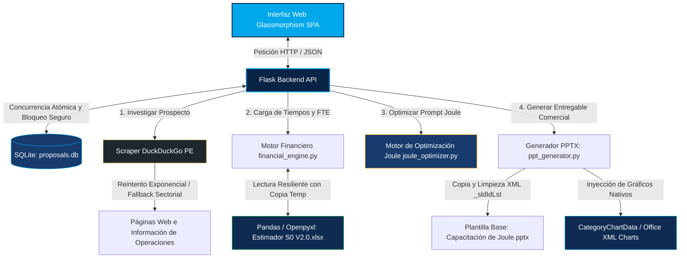

# Grow Deck Automator - Solución Agéntica de Preventa para SAP S/4HANA Cloud

**Grow Deck Automator** es una suite empresarial de preventa de nivel mundial desarrollada para **SEIDOR Perú**. Automatiza por completo la investigación de prospectos en el Perú, realiza simulaciones financieras del estimador modular de SAP, y genera presentaciones en formato PowerPoint widescreen (16:9) incorporando gráficos nativos interactivos de Office, localización multimoneda e impuestos locales peruanos.

---

## 🚀 Arquitectura del Sistema (Flujo de Datos)

El siguiente diagrama en formato **Mermaid** describe cómo interactúan los distintos componentes de software del sistema:



### Flujo de Trabajo Técnico:
1. **Interfaz Web Glassmorphism:** SPA interactiva que permite ingresar la empresa y sector, configurar tarifas de consultores, porcentajes de soporte y personalizar licencias modulares.
2. **Flask Backend API:** Coordina de manera asíncrona la orquestación del scraper, el procesamiento del motor financiero y la compilación del deck de PowerPoint.
3. **Scraper DuckDuckGo PE:** Extrae información corporativa de la web local empleando políticas de **reintento exponencial** ante bloqueos de red (429/503), y clasifica la complejidad en *Alta* o *Media* según heurísticas del sector.
4. **Motor Financiero (Pandas / Openpyxl):** Lee dinámicamente las estimaciones del archivo `Estimador S0 V2.0.xlsx`, mapea los alcances modulares de SAP S/4HANA (FI, CO, MM, SD, PP, PS) y computa horas, costos de implementación, licencias y soporte.
5. **Optimizador de Prompts de Joule:** Aplica reglas y "Palabras Mágicas" (MOSTRAR, LISTAR, BUSCAR, ABRIR) para estandarizar las consultas del usuario hacia el copiloto Joule de SAP, limpiando términos subjetivos.
6. **python-pptx & Gráficos XML Nativo:** Abre la plantilla de diseño institucional (`Capacitación de Joule - El futuro de SAP.pptx`), limpia todas las diapositivas previas sin alterar la estructura XML del `Slide Master`, inyecta la información comercial y genera gráficos circulares y de columnas nativos (compatibles con Excel y editables en Office).

---

## ✨ Características Core

- **Localización Bimoneda (USD/PEN):** Estructura de presentación comercial bimoneda que convierte costos y cotizaciones a Soles (PEN) y Dólares (USD) usando un tipo de cambio regulado y persistente en base de datos. Formatos limpios según estándar local (ej. `S/. 150,000.00` y `$45,000.00`).
- **Cálculo Automático de IGV (18%):** Desglose impositivo automatizado a nivel de Inversión Inicial Neta Año 1, IGV (18%) e Inversión Total Facturable, garantizando coherencia en todas las láminas comerciales de la propuesta.
- **Manejo de Concurrencia Atómica:** Arquitectura de acceso a base de datos basada en transacciones seguras y bloques de contexto atómicos (`with sqlite3.connect` y `contextlib.closing`). Previene excepciones críticas de bloqueo de base de datos (`database is locked`) bajo escenarios de alta concurrencia o hilos paralelos.
- **Resiliencia ante Archivos Excel Bloqueados:** Si el archivo principal `Estimador S0 V2.0.xlsx` está abierto en modo exclusivo por otro usuario o por un proceso en red de Windows, el sistema intercepta la excepción `PermissionError` y realiza una **copia temporal en caliente** para efectuar la lectura sin interrumpir el flujo del usuario.

---

## 🛠️ Guía de Instalación y Despliegue

### Requisitos Previos:
- Python 3.11+ (para ejecución directa en Windows/Linux/macOS)
- Docker y Docker Compose (para despliegue productivo en contenedores)

---

### Opción A: Despliegue con Docker y Docker Compose (Producción)

1. **Configurar Variables de Enorno para Endpoints de IA:**
   Cree o configure las variables en su archivo `.env` o directamente en el `docker-compose.yml`:
   ```bash
    # Configuración de Endpoints de IA y Scraping
    JOULE_AI_ENDPOINT=https://tu-endpoint-ejemplo.com/v1/optimize
    JOULE_API_KEY=tu-api-key-aqui
    SCRAPER_MAX_RETRIES=3
    SCRAPER_BACKOFF_FACTOR=2.0
   ```

2. **Levantar los servicios:**
   Ejecute el siguiente comando en la raíz del proyecto para construir la imagen e iniciar los contenedores de forma aislada en segundo plano:
   ```bash
   docker-compose up --build -d
   ```

3. **Verificar estado de los contenedores:**
   ```bash
   docker-compose ps
   ```
   La aplicación Flask estará disponible en: **[http://localhost:5000](http://localhost:5000)**.

---

### Opción B: Ejecución Local Tradicional

1. **Instalar Dependencias:**
   ```bash
   pip install -r requirements.txt
   ```

2. **Configurar Entorno Local (Windows Powershell):**
   ```powershell
   $env:JOULE_AI_ENDPOINT="https://tu-endpoint-ejemplo.com/v1/optimize"
   $env:JOULE_API_KEY="tu-api-key-aqui"
   ```

3. **Inicializar y Estructurar Base de Datos SQLite:**
   ```bash
   python database_setup.py
   ```

4. **Ejecutar el Servidor Flask de Desarrollo:**
   ```bash
   python app.py
   ```
   Abra en su navegador la dirección: **[http://127.0.0.1:5000](http://127.0.0.1:5000)**.

---

## ⚙️ Variables de Entorno y Configuración Comercial

Los parámetros base para las cotizaciones comerciales y la localización financiera se guardan en la tabla `configuracion_comercial` en SQLite, modificables en caliente mediante el panel de **Ajustes** en la UI:

| Parámetro | Valor por Defecto | Descripción |
| :--- | :--- | :--- |
| `tarifa_hora_consultor` | `60.00` | Tarifa horaria por consultor SAP (USD). |
| `porcentaje_ams` | `0.15` | Porcentaje de soporte post Go-Live aplicado sobre consultoría (15%). |
| `margen_saas` | `0.20` | Margen de recargo comercial sobre licencias de suscripción SaaS (20%). |
| `anos_roi` | `5.00` | Años de proyección financiera para el ROI del proyecto (5 años). |
| `factor_igv` | `0.18` | Tasa del Impuesto General a las Ventas en el Perú (18%). |
| `tipo_cambio_pen` | `3.78` | Tipo de cambio oficial de Dólar (USD) a Soles (PEN). |
